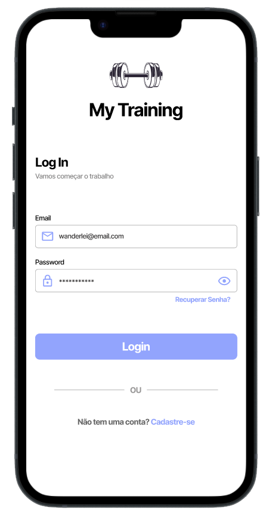
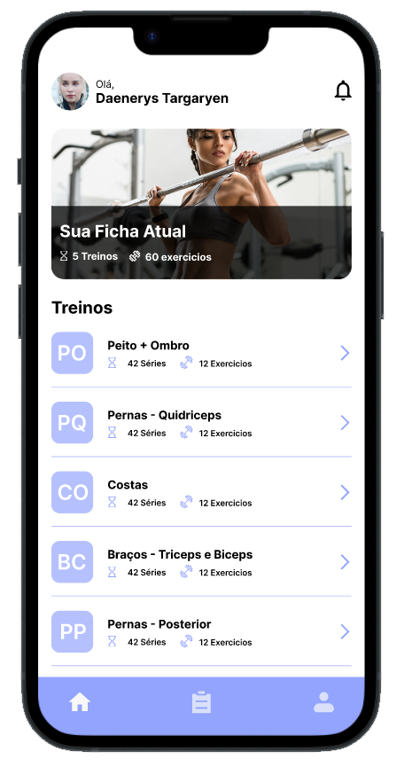
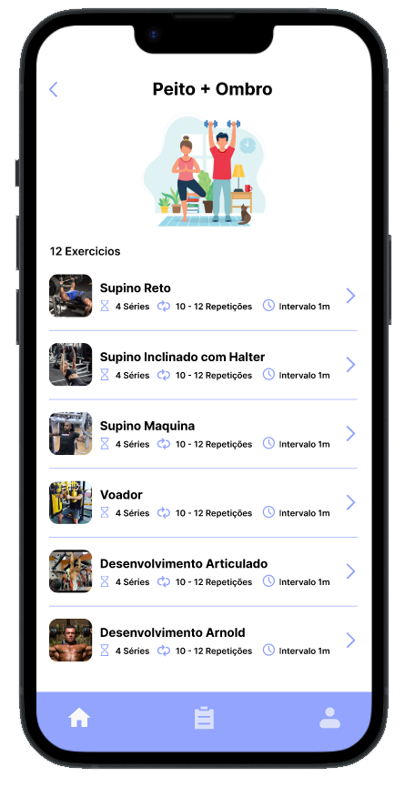
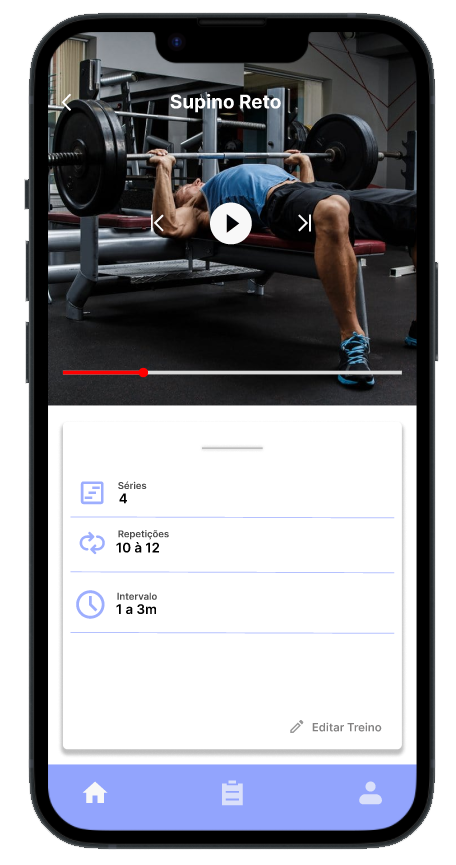
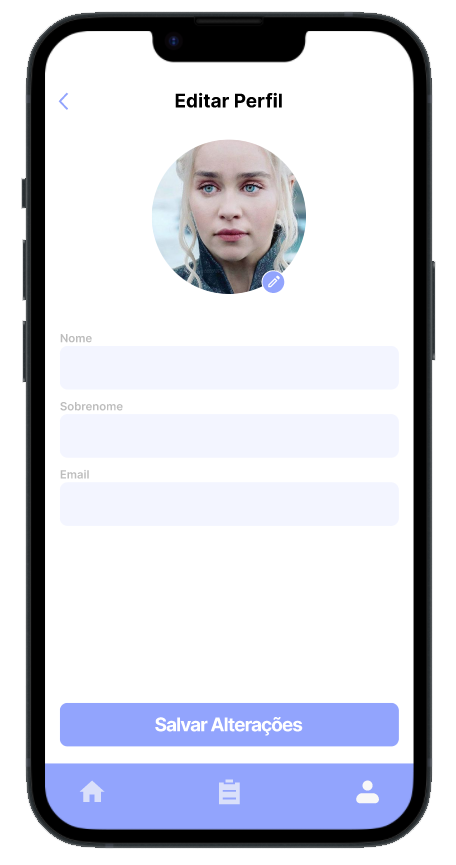

<h1 align="center">
# MyTraining  
</h1>

  
  
  
  

  O <b>My Training</b> é um projeto pessoal elaborado para controlar os treinos de um dos meus hobbies favoritos, academia. 
  O projeto tem sua API criada em <a href="https://learn.microsoft.com/pt-br/aspnet/core/?view=aspnetcore-6.0">Asp.net Core</a>,  
  a interface mobile foi feita em android nativo com <a href="https://kotlinlang.org/">Kotlin</a>.

# Protótipo Mobile

  
  
  
  
  

# Arquitetura

O Projeto foi desenvolvido utilizando Clean Architecture com .NET 6.

Nos testes foi utlizado xUnit, Fluent Assertions, Bogus, Moq e FakeItEasy

Entity Framework para acesso a dados

# :computer: Autores

<table>
  <tr>
    <td align="center">
      <a href="http://github.com/wanderleisantos/">
        
         
        
          <b>Wanderlei Santos</b>
        
       </a>
        
       <a href="https://www.linkedin.com/in/wanderleidossantos/" title="Linkedin">@Wanderlei Santos</a>
        
    </td>
    <td align="center">
      <a href="https://github.com/brunojsampaio">
        
         
        
          <b>Bruno Sampaio</b>
        
       </a>
        
       <a href="https://www.linkedin.com/in/brunojsampaio/" title="Linkedin">@Bruno Sampaio</a>
               
    </td>
  </tr>
</table>